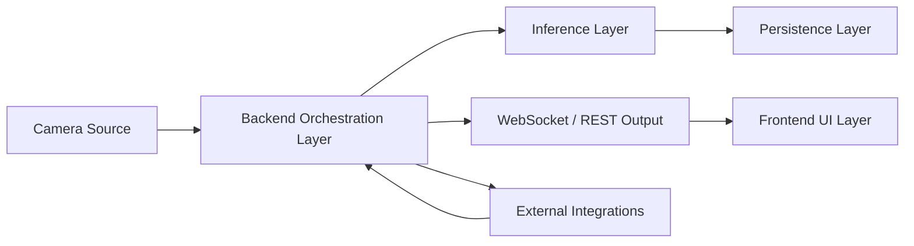

# SafeGuard 360 Architecture

`SafeGuard 360 is a local-first edge safety platform whose browser UI sits on
top of a backend runtime that owns the camera, runs computer-vision inference,
stores state locally, and streams live results back to operators.`

This document explains the system as an engineering design, not just as a list
of folders.

## Product Boundary

The project has two major sides:

- the `web application side`
  pages, controls, operator workflows, and visualizations
- the `local edge runtime side`
  camera ownership, local inference, local persistence, and live event
  generation

That split is the key architectural idea. SafeGuard 360 is not a typical app
where the browser contains most of the behavior. The browser is the presentation
and control layer. The site machine runs the actual safety runtime.

## Layered View



## Frontend UI Layer

Primary code:

- `frontend/src/pages/*`
- `frontend/src/services/api.js`

Responsibilities:

- render live operator dashboards
- render roster, review queue, logs, and settings
- send commands to the backend over HTTP
- subscribe to websocket updates for live status and frames

What it does **not** do:

- own the camera
- run PPE detection
- run face recognition
- run driver analysis

This distinction matters because it explains why the project remains usable as
a local operational system even if the browser is just one tab among many. The
frontend is the operator view into the runtime, not the runtime itself.

## Backend Orchestration Layer

Primary code:

- `backend/app/factory.py`
- `backend/app/api/*`
- `backend/app/services/*`
- `backend/app/camera/*`

Responsibilities:

- own the active camera session
- choose whether the system is in gate mode or driver mode
- route frames to the correct runtime
- expose control endpoints for the frontend
- convert runtime decisions into stored state and live websocket events

This layer is the conductor. It does not replace the inference code, but it
ensures that inference, persistence, and operator actions stay synchronized.

## Inference Layer

Primary code:

- `backend/app/inference/*`
- `backend/app/camera/driver_runtime.py`

Responsibilities:

- face matching against enrolled workers
- PPE analysis for helmet and vest compliance
- MediaPipe-based fleet monitoring

The project contains more than one computer-vision pipeline, which is one of
its more interesting engineering properties:

- gate recognition is identity-focused
- PPE detection is compliance-focused
- fleet monitoring is state/behavior-focused

These pipelines are different in purpose, but they still share a single
operational runtime.

## Persistence Layer

Paths:

- `data/safeguard360.db`
- `backend/data/attendance/`
- `backend/data/faces/`
- `backend/data/mail/`

Responsibilities:

- operator accounts
- enrolled workers
- attendance records
- gate reviews
- events and alerts
- snapshots and enrollment media
- locally captured auth emails in local mail mode

Persistence is important in this project because the system is not meant to be
only a live feed. A real safety platform should preserve what happened, who was
involved, and what the operator decided.

## External Integrations Layer

Primary examples:

- `Groq` for the chatbot
- `Resend` for outbound auth email

These integrations extend the platform, but they are not the core safety
runtime. That is an important design boundary:

- Attendance, PPE, Fleet, and Logs remain local-first
- chatbot and email add platform completeness around the local core

## Why a Shared Camera Manager Exists

Primary file:

- `backend/app/camera/manager.py`

The camera manager exists because camera access is a scarce resource. If the
gate page and fleet page each opened the camera independently, the project
would suffer from:

- conflicting access to the same device
- duplicated capture loops
- inconsistent live state
- race conditions between modules

The shared camera manager solves this by acting as the single arbitration point
for camera ownership. It opens the source once, stores the latest frame, and
lets the active runtime consume that frame without forcing the browser or other
modules to touch the camera directly.

## How Gate and Fleet Avoid Conflicting

Gate monitoring and Fleet monitoring both want live frames, but they should not
run as unrelated camera apps inside the same product.

They avoid conflict by sharing:

- one camera manager
- one active mode selection
- one live preview path
- one websocket broadcasting layer

At any given moment, the backend decides which mode is active:

- `gate`
  attendance, PPE, review, and roster state
- `driver`
  fatigue/distraction and driver overlay state

This keeps the runtime deterministic and avoids two separate modules fighting
over capture timing or camera ownership.

## Request/Response and Realtime Split

SafeGuard 360 uses two communication patterns because they serve different
needs.

### REST API

Use REST when the frontend needs a controlled request/response interaction:

- get logs
- load roster data
- decide a review
- change gate mode
- sign in
- request password reset

REST is good for explicit commands and persisted data retrieval.

### WebSocket

Use websocket when the frontend needs changing live state:

- preview frames
- gate status
- driver status
- event notifications

Websocket is good for continuous updates that should appear immediately without
polling.

This split keeps the system easier to reason about:

- REST = command and retrieval path
- websocket = live operational state path

## Data and Control Flow

The most useful compact summary is:

```text
Operator action
  -> backend API
  -> service/runtime logic
  -> database/event/state update
  -> websocket/status refresh
  -> frontend UI update
```

Examples:

- operator approves a review
  -> backend resolves the review
  -> attendance may be logged
  -> logs/state update
  -> frontend refreshes roster and review queue

- camera sees a worker
  -> runtime evaluates face/PPE
  -> backend creates live gate state
  -> websocket pushes the result
  -> frontend updates the feed

## Runtime Modes

### Idle

- camera not actively used for inference
- no gate or fleet worker is driving decisions

### Gate

- attendance recognition is active
- PPE logic is active
- review and roster state is active

### Driver

- fleet monitoring is active
- MediaPipe driver state is active
- fatigue/distraction events can be emitted

## Source-Controlled vs Local-Only Data

### Source-controlled

- code
- docs
- templates
- tests

### Local-only

- `.env`
- SQLite database
- model weights
- captured attendance media
- enrollment images
- runtime logs and caches

This separation is part of the architecture, not just a Git preference. The
project is designed to keep operational data and machine-specific dependencies
local to the site runtime.

## Related Docs

- [system-flow.md](system-flow.md)
- [attendance-gate.md](attendance-gate.md)
- [auth-email.md](auth-email.md)
